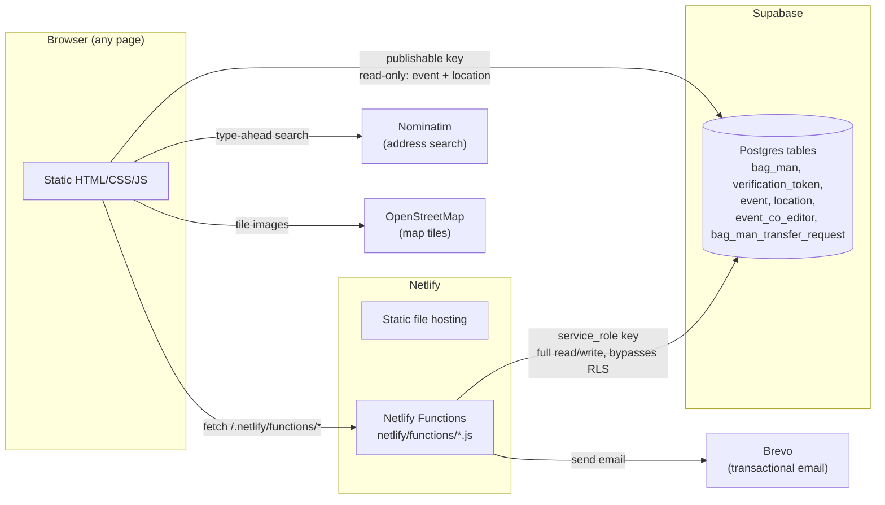
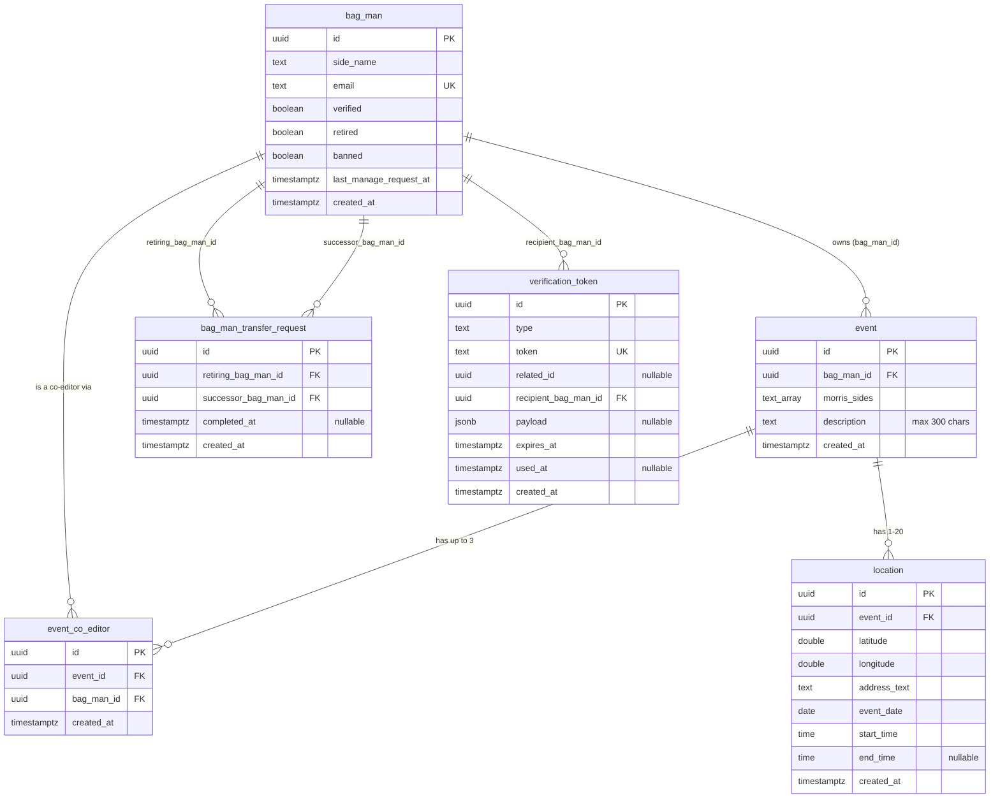

# 00 — Whole-site overview

## Tech stack

| Layer | What | Notes |
|---|---|---|
| Frontend | Plain HTML5 + CSS3 + vanilla JS | No framework, no build step, no bundler — every `.js` file is loaded directly by a `<script>` tag |
| Client-side DB access | `supabase-js` v2 (UMD CDN bundle) | Used only by the public map/calendar (read-only, publishable key) |
| Maps | Leaflet.js 1.9.4 (CDN) + OpenStreetMap tiles | Also used for the draggable pin in the event submission form |
| Address search | Nominatim (OpenStreetMap, free, no API key) | Used only inside the event submission form |
| Calendar | FullCalendar 6.1.15 (CDN, global bundle) | Public calendar view only |
| Backend | Netlify Functions (Node.js) | One `.js` file per endpoint in `netlify/functions/` |
| Database | Supabase Postgres (free tier) | Accessed via PostgREST (`/rest/v1/...`), never a direct Postgres connection |
| Email | Brevo transactional email (free tier) | Every email in the site goes through `https://api.brevo.com/v3/smtp/email` |
| Hosting | Netlify (free tier) | Auto-deploys from GitHub; static files served as-is, no base/build/publish dir overrides |

## High-level architecture

Two very different trust levels talk to Supabase, and that split is the core of the site's
security model:

- **The browser** only ever holds the Supabase **publishable key**, and only ever reads
  `event`/`location` — the two tables with a public read policy (see below). It never
  writes to Supabase directly; every write goes through a Netlify Function.
- **Netlify Functions** hold the Supabase **secret key** (`SUPABASE_SECRET_KEY`, a
  `service_role` key), which bypasses Row-Level Security entirely. This is why *all*
  validation (is this bag-man verified? is this the owner or a
  co-editor?) happens inside the function, server-side — the client's claims are never
  trusted.

## The six database tables

All created in one migration (Phase 2); nothing since has added a new table, only columns.

`verification_token.type` is a check constraint, one of: `bagman_registration`, `event_publish`,
`event_edit`, `event_delete`, `bagman_retirement_transfer`, `bagman_strike_off` (that last one
isn't used by any built function yet — reserved for a future webmaster ban flow).

## Row-Level Security + grants (defence in depth)

- `event` and `location`: RLS enabled, **one public policy** (`for select using (true)`), plus
  `grant select ... to anon, authenticated`. Anyone can read every event/location; nobody but a
  Netlify Function can write to them.
- `bag_man`, `verification_token`, `event_co_editor`, `bag_man_transfer_request`: RLS enabled,
  **zero policies**, **zero grants** to `anon`/`authenticated`. Completely unreadable/unwritable
  from the browser, full stop — two independent locks (RLS + grants) rather than one.
- `service_role` (what every Netlify Function authenticates as via `SUPABASE_SECRET_KEY`) has
  `BYPASSRLS`, but that only skips RLS — it still needed explicit
  `grant select, insert, update, delete on <table> to service_role` for every table, run once
  in Phase 2.

## Environment variables (all of them, whole site)

| Variable | Used by | Secret scanning? | Notes |
|---|---|---|---|
| `SUPABASE_URL` | every Netlify Function | No | Bare project URL, e.g. `https://xxxx.supabase.co` |
| `SUPABASE_SECRET_KEY` | every Netlify Function (via `_supabase.js`) | **Yes** | `service_role` key — bypasses RLS |
| `BREVO_API_KEY` | every function that sends email | **Yes** | Brevo transactional email API key |
| `WEBMASTER_EMAIL` | contact form + registration emails | No | Verified Brevo sender address, also the webmaster's own inbox |
| `SITE_URL` | any function that builds an emailed link | No | Production URL, no trailing slash |
| `ADMIN_SECRET` | `approve-bagman-registration.js` only | **Yes** | Shared secret typed into `admin-approve-bagman.html`, compared with `crypto.timingSafeEqual` |

Separately, `find-events-data.js` (the public map/calendar) hardcodes the Supabase **project
URL** and **publishable key** directly in client-side JS — this is intentional and safe (it's
the whole point of a "publishable" key, and the browser can't read Netlify env vars without a
build step anyway), not a leak.

## `netlify.toml`

The only setting is `functions = "netlify/functions"`. Base directory, build command, and
publish directory are all left blank — every file at the repo root is published as-is, zero
config.

## Shared files used by (almost) every page

- [nav.js](../../nav.js) — injects the same nav bar into `#site-nav` on every page (Home / Find
  events / Add events / Links / Contact us).
- [styles.css](../../styles.css) — shared look (dark green nav, Arial body text, form styling,
  the honeypot-hiding `.honeypot-field` class, the map legend dot colours).
- [netlify/functions/_supabase.js](../../netlify/functions/_supabase.js) — the one place
  `SUPABASE_URL`/`SUPABASE_SECRET_KEY` are read; every other function calls its
  `supabaseRequest(path, options)` helper rather than hitting `fetch` directly.
