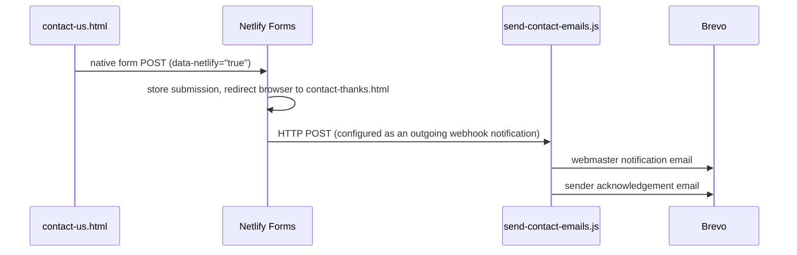

# 01 — Static content pages + the contact form

## Plain static pages

- [index.html](../../index.html) — home page, intro text + nav links.
- [links.html](../../links.html) — alphabetical list of Oxfordshire Morris sides, plus the
  Morris Federation, Oxfordshire Folk Dance Association, and Folk in Oxford. No JS.
- [contact-thanks.html](../../contact-thanks.html) — plain static "thanks" landing page, no JS.

None of these touch Supabase or Netlify Functions — they're served as-is by Netlify.

## The contact form

[contact-us.html](../../contact-us.html) uses **Netlify Forms** natively — there's no
`contact-us.js` and no `fetch()` call for the submission itself:

- `data-netlify="true"` is what actually triggers Netlify's build-time detection of the form;
  `data-netlify-honeypot="bot-field"` is unrelated to detection — it just tells Netlify which
  field name to treat as a spam-trap (see honeypot bullet below).
- A hidden `name="form-name"` input with value `"contact"` (required by Netlify Forms).
- Real fields: `email` (required), `message` (textarea, max 1000 chars, with a live
  `.char-count` counter).
- Honeypot field `bot-field`, hidden via the shared `.honeypot-field` CSS class
  (`position: absolute; left: -9999px;`) — bots that fill in every field get silently rejected
  by Netlify before the submission even reaches a function.
- A Cloudflare Turnstile widget (`.cf-turnstile`, hardcoded Site Key — not a secret) sits
  alongside the honeypot as a second, CAPTCHA-based layer (Phase 8) — its token rides through
  Netlify Forms like any other field and is verified server-side in `send-contact-emails.js`.
- On success, the browser is redirected to `/contact-thanks.html` (the form's implicit action).

## What happens after submission

The webhook is configured in the Netlify dashboard, **not** in code: Project configuration →
Notifications → Form submission notifications → **HTTP POST request** (not "Email
notification") → target `https://<site>/.netlify/functions/send-contact-emails`. This only
works once "Form detection" has been on for at least one deploy — see the `netlify.md` gotchas
if a form ever doesn't show up in that dropdown.

[send-contact-emails.js](../../netlify/functions/send-contact-emails.js) reads the submitted
fields from `event.body`'s `payload.data.{email, message}` (that's the shape Netlify's webhook
sends, not a shape this project chose). Before sending anything, it verifies the Turnstile
token (`payload.data['cf-turnstile-response']`) via `_turnstile.js`, and checks a per-email
cooldown via `_supabase.js`'s `checkAndBumpRateLimit()` against the `contact_rate_limit` table
(Phase 8) — either check failing is a silent no-op (`200 OK`, no emails sent), so a bot never
learns which check it tripped. Once past both, it sends both emails via
`https://api.brevo.com/v3/smtp/email` using `BREVO_API_KEY` and `WEBMASTER_EMAIL`. Both emails
are plain text, no HTML.
