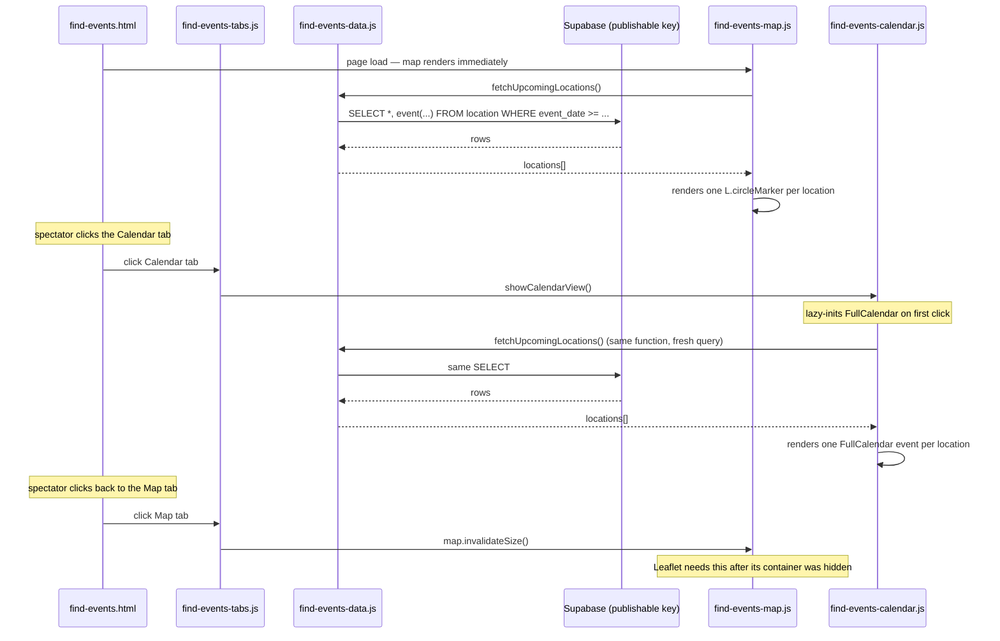

# 02 — The public map + calendar ("Find events")

This is the only part of the site the browser reads from Supabase directly — no Netlify
Function is involved in showing events to a spectator.

## Shared data layer

[find-events-data.js](../../find-events-data.js) is loaded by both the map and calendar
scripts and is the **single source of truth** for fetching + shaping event data, so the two
views can never disagree with each other:

- Creates one Supabase client with a hardcoded project URL + **publishable** key (safe to
  expose — see [00-overview](00-overview_v001.md)'s note on env vars).
- `fetchUpcomingLocations()` — the one query behind both views:
  `select('*, event(id, morris_sides, description)')` from `location`, filtered to
  `event_date >= twoMonthsAgoISODate()`, ordered by `event_date` ascending. (No filter for
  the far future — old past events beyond 2 months are the only thing excluded, to keep the
  query small.)
- `groupLocationsByEvent(locations)` — groups by `event.id` so a multi-location event ("also
  dancing at…") can list its siblings in the popup/modal.
- `isPastLocation(location)` / `locationFinishDate(location)` — a location counts as **past**
  once `event_date + (end_time or start_time)` is before "now". This is the whole
  past-vs-future colour logic — no scheduled job, no manual archiving, just a comparison done
  at render time on every page load.
- `FUTURE_COLOR = '#ff0000'`, `PAST_COLOR = '#8888dd'` — the two colours used by both the map
  markers and the calendar events, and echoed in the `.map-legend` in `find-events.html`.
- `buildEventDetailsHtml(location, siblingLocations)` — the HTML for both the map's Leaflet
  popup and the calendar's click-modal, so the two views show identical event details.

## Map view

[find-events-map.js](../../find-events-map.js): Leaflet.js, OpenStreetMap tiles, centred on
`[51.77, -1.25]` (Oxford) at zoom 10. Each location becomes an `L.circleMarker` (radius 6,
white border, filled with `FUTURE_COLOR`/`PAST_COLOR` depending on `isPastLocation()`), with a
popup built by `buildEventDetailsHtml()`.

## Calendar view

[find-events-calendar.js](../../find-events-calendar.js): FullCalendar 6, `dayGridMonth` view,
valid range `twoMonthsAgoISODate()` → `twelveMonthsAheadISODate()`. Each location becomes one
FullCalendar event (`start`/`end` built from `event_date` + `start_time`/`end_time`,
`backgroundColor`/`borderColor` from the same two constants). Clicking an event opens the
shared `#event-modal` using the same `buildEventDetailsHtml()` as the map's popup.

The calendar is only actually initialised the first time its tab is clicked (FullCalendar sizes
itself incorrectly if initialised while its container is `hidden`) — this lazy-init is handled
by [find-events-tabs.js](../../find-events-tabs.js), which also toggles the
`.view-tab--active`/`aria-selected` state on the two tab buttons and calls
`map.invalidateSize()` when switching back to the map tab (Leaflet has the same
"sized-while-hidden" problem in reverse).

## Data flow

Nothing here ever writes to Supabase — creating/editing/deleting events is entirely covered by
[04-event-submission-and-editing](04-event-submission-and-editing_v001.md).
