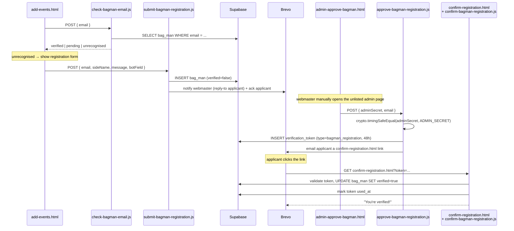

# 03 — Bag-man registration + admin approval

Four stages, three different people involved (applicant, webmaster, then the applicant again):
**check email → register → webmaster approves → applicant confirms.** Nothing about a bag-man
is ever created or trusted without that last confirmation click — same pattern as every flow in
[04](04-event-submission-and-editing_v001.md)/[05](05-bagman-retirement-handover_v001.md).

## Stage 1 — Email check

[add-events.html](../../add-events.html)'s `#email-check-form` → `POST
/.netlify/functions/check-bagman-email` → [check-bagman-email.js](../../netlify/functions/check-bagman-email.js)
looks up `bag_man` by email and returns one of:

| Status | Meaning | What the browser shows next |
|---|---|---|
| `verified` | Row exists, `verified=true` | The verified-section screens ([04](04-event-submission-and-editing_v001.md)/[05](05-bagman-retirement-handover_v001.md)) |
| `pending` | Row exists, `verified=false`, `banned=false` | "Awaiting approval" message |
| `unrecognised` | No row, **or** row exists with `banned=true` | The registration form |

Banned and "never registered" deliberately return the **same** status — a banned applicant
can't tell they've been banned, they just see the ordinary registration form again.

## Stage 2 — Registration

`#registration-form` (side name, free-text message, honeypot field hidden via
`.honeypot-field`, plus a Cloudflare Turnstile widget added in Phase 8) → `POST
/.netlify/functions/submit-bagman-registration` →
[submit-bagman-registration.js](../../netlify/functions/submit-bagman-registration.js):

- Honeypot filled in → silently return success, do nothing (bot never learns it was rejected).
- Turnstile token fails verification, or the per-email `contact_rate_limit` cooldown hasn't
  elapsed (same table/helper as the Contact form, [01](01-static-content-and-contact_v001.md))
  → also silently return success, same "don't reveal what tripped it" principle.
- Already banned → also silently return success, no row touched, no email sent.
- Already registered (pending or verified) → returns `already-registered`, no duplicate row.
- Otherwise → `INSERT into bag_man (side_name, email, verified=false)`, then emails **both**
  the webmaster (reply-to set to the applicant, so replying goes straight to them) and the
  applicant (acknowledgement, no verification link yet — that only comes after approval).

## Stage 3 — Webmaster approval (manual, out-of-band)

[admin-approve-bagman.html](../../admin-approve-bagman.html) is a deliberately unlisted page —
no nav bar, `<meta name="robots" content="noindex, nofollow">`. It's not linked from anywhere;
the webmaster just knows the URL. A form asks for an **admin secret** (password field) and the
applicant's email, then `POST /.netlify/functions/approve-bagman-registration` →
[approve-bagman-registration.js](../../netlify/functions/approve-bagman-registration.js):

- Compares the submitted secret to `ADMIN_SECRET` using `crypto.timingSafeEqual` (constant-time,
  so a wrong guess can't be narrowed down via response-time differences) → wrong secret is a
  plain `403`.
- Looks up the bag-man; returns `not-found` / `already-verified` / `banned` if any apply.
- Otherwise issues a `bagman_registration` `verification_token` (48h expiry) and emails the
  applicant a link to `confirm-registration.html?token=...`. **This is the only step that
  creates the verification email** — approval and "send me a verification link" are the same
  action, there's no separate "approve" vs "send link" step.

This admin page's only protection is the shared secret — there's no session/login system, so
treat `ADMIN_SECRET` with the same care as any other secret in `.env`/Netlify's environment
variables.

## Stage 4 — Confirmation

[confirm-registration.html](../../confirm-registration.html) reads `?token=`, calls `GET
/.netlify/functions/confirm-bagman-registration?token=...` →
[confirm-bagman-registration.js](../../netlify/functions/confirm-bagman-registration.js), which
checks the token exists/is unused/isn't expired, then `UPDATE bag_man SET verified=true` and
marks the token used. From this point `check-bagman-email.js` will return `verified` for this
address.

## End-to-end flow

