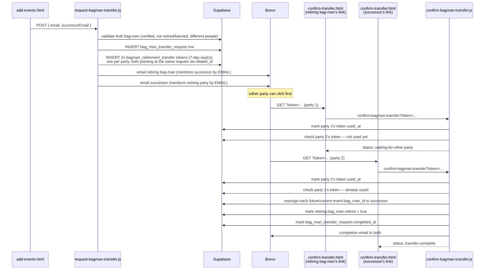

# 05 — Bag-man retirement / handover

The only **two-sided** confirmation in the site — nothing happens until *both* the retiring
bag-man and their named successor have clicked their own link. Split out from
[04-event-submission-and-editing](04-event-submission-and-editing_v001.md) since it's a
fairly separate concern (it touches `bag_man`/`bag_man_transfer_request`, not `event` directly,
until the very last step).

## Files involved

| Step | Browser page | Browser script | Netlify function |
|---|---|---|---|
| Request handover | `add-events.html` → `retire-section` | `add-events.js` | `request-bagman-transfer.js` |
| Confirm handover (either party) | `confirm-transfer.html` | `confirm-transfer.js` | `confirm-bagman-transfer.js` |

## Flow

## Why by email, not side name

Emails and status messages always refer to the other party by their **email address**, never
`bag_man.side_name` — a retiring bag-man and their successor are very often from the *same*
side, so "your events have been handed over to Abingdon Traditional Morris" would be confusing
or plain wrong when the successor is also Abingdon Traditional Morris. `bag_man` has no
personal name column, only `side_name` and `email`, so email is the only individually-identifying
field available.

## Why only future/current events move

`confirm-bagman-transfer.js` only reassigns `event.bag_man_id` for events with at least one
`location` whose `event_date`/`end_time` (or `start_time` if no end time) is still in the
future — past events keep their original owner, for accurate historical attribution on
whoever actually ran that event.

## The `verification_token` type used here

(Full schema in [00-overview](00-overview_v001.md); the other four types are in
[04-event-submission-and-editing](04-event-submission-and-editing_v001.md).)

| `type` | `payload`? | Created by | Consumed by | Expiry | Notes |
|---|---|---|---|---|---|
| `bagman_retirement_transfer` | null | `request-bagman-transfer.js` | `confirm-bagman-transfer.js` | **7 days** (longer than the 48h event tokens, since it needs two separate people to act) | Issued in pairs — one row in `bag_man_transfer_request`, two tokens, both sharing `related_id` |
