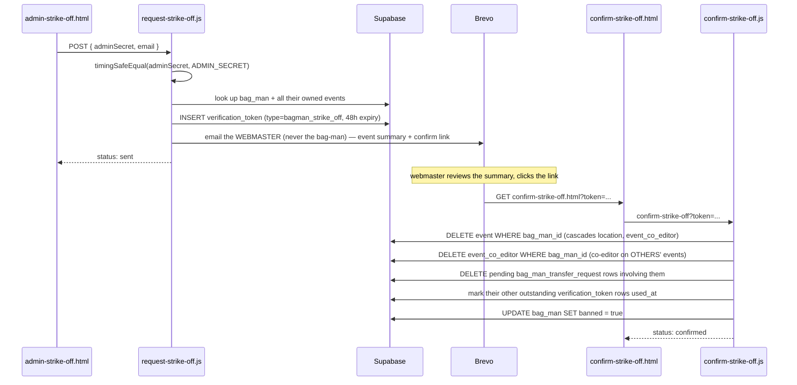

# 06 — Webmaster strike-off

The most privileged, and only deliberately **one-sided**, action in the site (plan §9.10): the
webmaster bans a bag-man for misuse, no confirmation from anyone but the webmaster themself
needed. Unlike every other flow, it's reached through an unlisted admin page rather than
anything a bag-man can trigger.

## Files involved

| Step | Browser page | Browser script | Netlify function |
|---|---|---|---|
| Request strike-off | `admin-strike-off.html` (unlisted, `noindex`) | `admin-strike-off.js` | `request-strike-off.js` |
| Confirm strike-off | `confirm-strike-off.html` | `confirm-strike-off.js` | `confirm-strike-off.js` (function) |

## Flow

## Why the confirmation email goes to the webmaster, not the bag-man

Every other verification email in this site goes to the person the action is *about*, proving
the request came from their own mailbox. Strike-off is the opposite: the bag-man being struck
off must never see or click anything — the confirmation is purely a "did the webmaster really
mean this, here's exactly what will be deleted" safety net against a mis-click, not a second
opinion from anyone else.

## Why `banned` is a flag, not a deleted row

Every `event` the bag-man owned is genuinely, cascadingly hard-deleted (not the passive
archiving used elsewhere — see [00-overview](00-overview_v001.md)). But the `bag_man` row
itself is kept, with `banned` set `true`, specifically so its unique `email` constraint keeps
blocking that address forever. `check-bagman-email.js` and `submit-bagman-registration.js`
(see [03-bagman-registration](03-bagman-registration_v001.md)) already treat a `banned` match
identically to "email not recognised" — the same ordinary registration screen a genuinely new
bag-man would see, so a struck-off individual gets no signal about what happened and the
registration handler silently drops any retry without emailing the webmaster again.

## The `verification_token` type used here

| `type` | `payload`? | Created by | Consumed by | Expiry | Notes |
|---|---|---|---|---|---|
| `bagman_strike_off` | null | `request-strike-off.js` | `confirm-strike-off.js` | 48 hours | Only token type whose confirmation link is emailed to the **webmaster**, never the subject bag-man |
