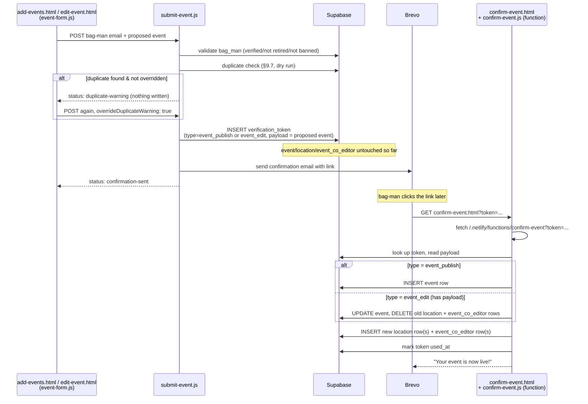
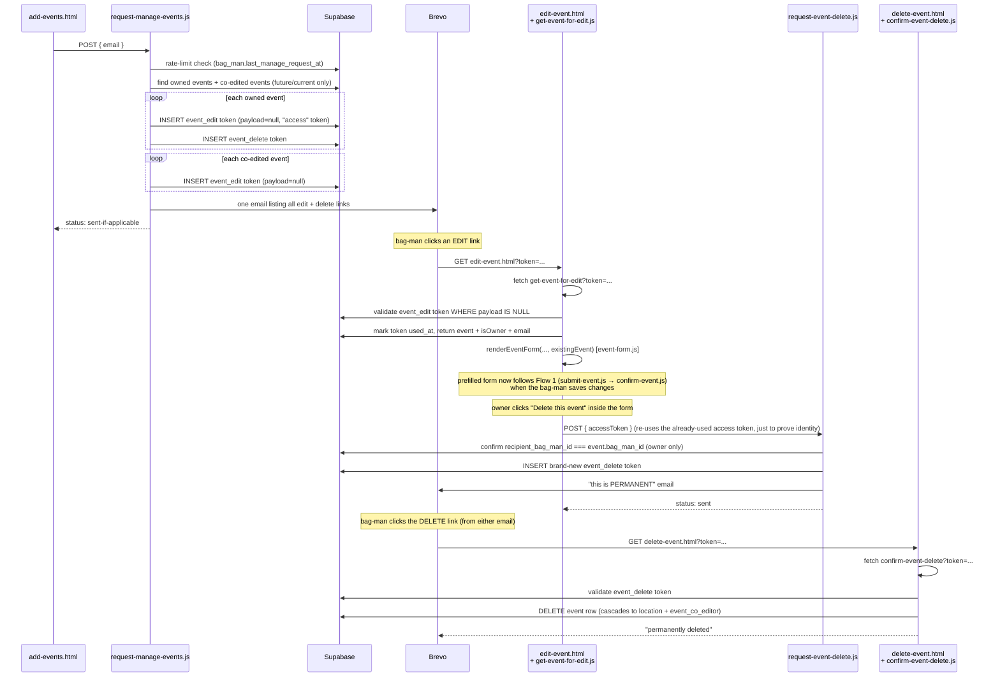
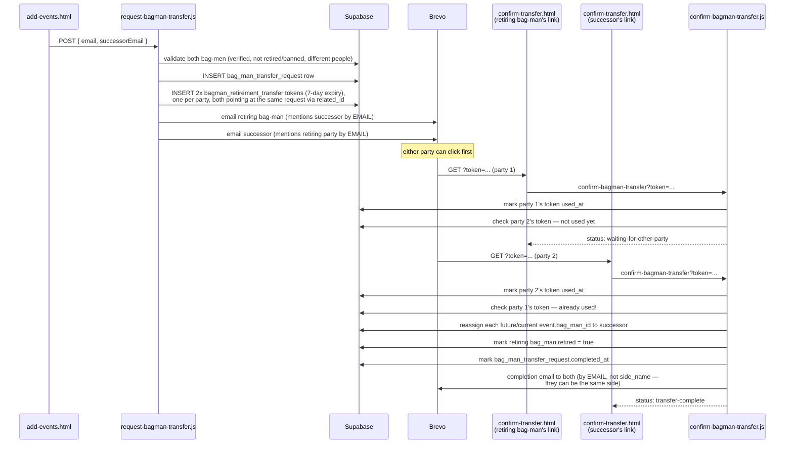

# Phase 7 architecture notes — how all the files fit together

Phase 7 ([phase7_event_submission_v001.md](phase7_event_submission_v001.md)) touches more files than any
other phase — this note is a map of the finished result, not a build guide. Read this
*after* Steps 1–8 are done, when you want the big picture back rather than one step at a time.

## The one big idea

Every "thing a bag-man can do" in this phase follows the **same two-step shape**:

1. A **`request-*`** step (triggered from a form) validates input, then writes a row to the
   single `verification_token` table and emails a link. **Nothing else changes in the
   database at this point** — no event is created/edited/deleted yet.
2. A **`confirm-*`** step (triggered by clicking the emailed link) looks up that token, checks
   it's real/unused/unexpired, does the actual database work, then marks the token used.

This is why so many small files exist: it's the same pattern repeated four times (new event,
edit event, delete event, retirement handover), plus one variant that skips step 1's "request"
form because it's re-issuing links instead of creating something new ("Manage my existing
events").

## File map

| Flow | Browser page (`.html`) | Browser script (`.js`, root) | Netlify function(s) (`netlify/functions/`) |
|---|---|---|---|
| Submit a **new** event | `add-events.html` → `event-form-section` | `event-form.js` (shared), `add-events.js` | `submit-event.js` |
| Confirm new/edited event | `confirm-event.html` | `confirm-event.js` | `confirm-event.js` (function) |
| Request fresh edit/delete links | `add-events.html` → `manage-events-section` | `add-events.js` | `request-manage-events.js` |
| **Edit** an existing event | `edit-event.html` | `edit-event.js`, `event-form.js` (shared) | `get-event-for-edit.js`, then `submit-event.js`, then `confirm-event.js` |
| Request event deletion | (button inside the edit form) | `event-form.js` (shared) | `request-event-delete.js` |
| Confirm event deletion | `delete-event.html` | `delete-event.js` | `confirm-event-delete.js` |
| Request bag-man handover | `add-events.html` → `retire-section` | `add-events.js` | `request-bagman-transfer.js` |
| Confirm bag-man handover | `confirm-transfer.html` | `confirm-transfer.js` | `confirm-bagman-transfer.js` |

`event-form.js` is the one file shared by two rows above — it renders the exact same
locations/sides/co-editors form whether it's blank (new event) or prefilled (edit), so the two
screens can never quietly drift apart from each other.

## Flow 1 — Submitting (or editing) an event

## Flow 2 — "Manage my existing events" → edit → delete

## Flow 3 — Bag-man retirement / handover

The only **two-sided** confirmation in the site — nothing happens until *both* people click.

## The `verification_token` table is doing five different jobs

One table, told apart by `type` and whether `payload` is set:

| `type` | `payload`? | Created by | Consumed by | Expiry | Notes |
|---|---|---|---|---|---|
| `bagman_registration` | no | `submit-bagman-registration.js` | `confirm-bagman-registration.js` | (Phase 6) | Approved by webmaster before this token is even issued |
| `event_publish` | yes (whole new event) | `submit-event.js` | `confirm-event.js` | 48h | `related_id` is null until confirmed — the event doesn't exist yet |
| `event_edit` (**access**) | **null** | `request-manage-events.js` | `get-event-for-edit.js` | 48h | Just proves "this email may open this event's form" |
| `event_edit` (**confirmation**) | yes (proposed edit) | `submit-event.js` | `confirm-event.js` | 48h | Same `type` as above, told apart by payload — see phase7 doc's "Quick concepts" |
| `event_delete` | null | `request-manage-events.js` **or** `request-event-delete.js` | `confirm-event-delete.js` | 48h | Two different senders, same job |
| `bagman_retirement_transfer` | null | `request-bagman-transfer.js` | `confirm-bagman-transfer.js` | **7 days** | Issued in pairs — one row in `bag_man_transfer_request`, two tokens |
| `bagman_strike_off` | — | *(not built yet — Phase 8)* | — | — | Webmaster-only ban flow |

## Two authorisation checks worth remembering

- **Owner vs co-editor** (`isOwner` in `get-event-for-edit.js`'s response, and the
  `existingEvent.bag_man_id === bagMan.id` check inside `submit-event.js`): decides whether
  `event-form.js` shows the co-editor list and "Delete this event" button at all, *and* is
  re-checked server-side on every submit — never trust the client's copy of `isOwner`.
- **A used access token can still answer "whose event is this?"** — `request-event-delete.js`
  looks up the (already-used) `event_edit` access token purely to read `recipient_bag_man_id`,
  not to re-authorise loading the form. This is why that lookup doesn't filter on `used_at`.
